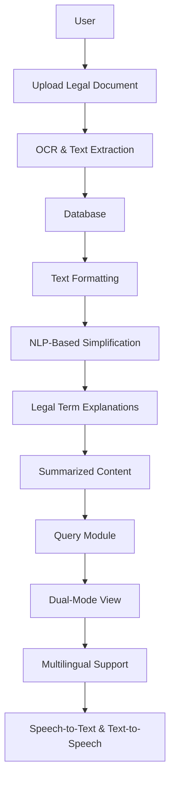

# Docufy 📜

**AI-Powered Legal Document Simplification**
## Overview 🔍

Docufy is an AI-driven legal document simplification tool that transforms complex legal jargon into clear, accessible language. The platform extracts text from legal documents, simplifies content while preserving meaning, provides definitions for legal terms, and offers multilingual support.

## Key Features ✨

### 📄 Legal Text Simplification
- Transforms complex legal language into plain, understandable terms
- Three simplification levels: Mild, Moderate, and Extreme
- Preserves the original legal intent throughout the simplification process

### 👓 Dual-Mode View
- Side-by-side comparison of original and simplified text
- Allows users to compare changes while ensuring legal accuracy is maintained

### 📚 Legal Term Explanations
- Interactive hover/click functionality for instant definitions of legal jargon
- Powered by Black's Law Dictionary API or a custom-built legal glossary

### 💬 Smart Query Module
- Ask contextual questions about the document content
- Receive AI-generated answers with proper citations to relevant sections

### 🔍 OCR & Image-to-Text Extraction
- Support for PDF, DOCX, and image uploads
- Advanced OCR to extract text from scanned documents and images

### 🌐 Multilingual Support
- Translate legal documents into multiple languages
- Ensure global accessibility for non-English speakers

### 🔊 Text-to-Speech & Speech-to-Text
- Convert simplified legal text into audio format
- Use voice commands to query legal documents

### ⚠️ Risk Analysis & Clause Detection
- Identify risky clauses and highlight potential legal concerns
- Suggest alternative phrasing for risk mitigation

## System Architecture 🏗️



## Getting Started 🚀

### Prerequisites 📋

- Node.js 16+
- Python 3.9+

### Installation & Setup 💻

```bash
# Clone the repository
git clone https://github.com/shreeshailchavan/legaldoc.git

# Navigate to project directory
cd docufy

# Install dependencies
npm install

# Install Python dependencies
pip install -r requirements.txt

# Start the development server
npm run dev
```

## Usage Guide 📖

1. **Upload a document** - Support for PDF, DOCX, or Image formats
2. **Select simplification level** - Choose between Mild, Moderate, or Extreme
3. **Explore legal terms** - Hover or click on highlighted terms to see definitions
4. **Ask questions** - Use the query module to get context-aware answers
5. **Compare versions** - Use the dual-mode view to see original vs. simplified text
6. **Access audio features** - Enable text-to-speech or use speech-to-text for queries

## Advanced Features 🔥

| Feature | Description |
|---------|-------------|
| **AI-Powered Clause Generator** 📝 | Suggests missing or recommended contract clauses |
| **Risk Highlighting System** ⚠️ | Flags potential legal risks in documents |
| **Contract Comparison Module** 🔍 | Identifies changes between document versions |
| **Offline Mode** 🌍 | Core functionality works without internet connection |

## License 📄

This project is licensed under the MIT License - see the [LICENSE](LICENSE) file for details.

## Contributing 🤝

Contributions are welcome! Please feel free to submit issues and pull requests.

1. Fork the repository
2. Create your feature branch (`git checkout -b feature/amazing-feature`)
3. Commit your changes (`git commit -m 'Add some amazing feature'`)
4. Push to the branch (`git push origin feature/amazing-feature`)
5. Open a Pull Request

---

✨ **Docufy: Making Legal Documents Simple for Everyone!** ✨
